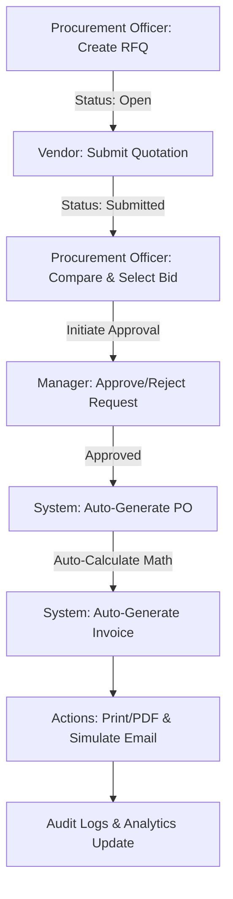

# VendorBridge ERP: Comprehensive System Analysis & Architectural Blueprint

This document provides a thorough analysis of the VendorBridge Procurement & Vendor Management ERP system based on the provided specifications, user roles, workflow steps, and design mockups.

---

## 1. Core Workflow ("The Golden Thread")
The golden thread represents the sequential flow of data and states from initial requirement gathering to invoice generation:

---

## 2. Role-Based Access Control (RBAC) Matrix

To ensure strict security and user isolation, each role is permitted to interact only with specific features:

| Screen / Feature | Procurement Officer | Vendor | Manager | Admin |
| :--- | :---: | :---: | :---: | :---: |
| **1. Login / Signup** | Yes | Yes | Yes | Yes |
| **2. Dashboard** | Custom View | Custom View | Custom View | Custom View |
| **3. Vendor Management** | View Only | View/Edit Profile | View Only | full CRUD |
| **4. RFQ Creation** | **Create/Edit** | No | No | No |
| **5. Quotation Submission** | No | **Submit/Edit** | No | No |
| **6. Quotation Comparison** | **Compare/Select** | No | No | No |
| **7. Approval Workflow** | View Timeline | No | **Approve/Reject** | No |
| **8. PO & Invoice Gen** | **Generate Docs** | View PO Only | View Only | No |
| **9. Activity Logs & Alerts** | View Logs | View Logs | View Logs | **Full Audit Trail** |
| **10. Reports & Analytics** | View Statistics | No | Monitor Workflows | **Full Analytics** |

---

## 3. Database Schema Design (Django Models)

Below is the proposed entity-relationship database design, structured clean across our initialized apps:

### `apps.authentication`
* **CustomUser** (Inherits `AbstractUser`)
  * `role`: Enum (`ADMIN`, `PROCUREMENT_OFFICER`, `VENDOR`, `MANAGER`)
  * `phone_number`: String

### `apps.vendors`
* **VendorProfile**
  * `user`: OneToOneField(`CustomUser`, related_name='vendor_profile')
  * `company_name`: String
  * `category`: Enum (e.g., `IT`, `LOGISTICS`, `RAW_MATERIALS`, `OFFICE_SUPPLIES`)
  * `gst_number`: String
  * `contact_details`: Text
  * `status`: Enum (`PENDING_VERIFICATION`, `ACTIVE`, `SUSPENDED`)
  * `rating`: Float (Average score calculated dynamically)

### `apps.rfqs`
* **RFQ** (Request for Quotation)
  * `title`: String
  * `description`: Text
  * `quantity`: PositiveIntegerField
  * `deadline`: DateTimeField
  * `created_by`: ForeignKey(`CustomUser` [Procurement Officer])
  * `assigned_vendors`: ManyToManyField(`VendorProfile`)
  * `status`: Enum (`DRAFT`, `OPEN`, `CLOSED`, `COMPLETED`)
  * `created_at`: DateTimeField
* **Quotation**
  * `rfq`: ForeignKey(`RFQ`, related_name='quotations')
  * `vendor`: ForeignKey(`VendorProfile`, related_name='quotations')
  * `price_per_unit`: DecimalField
  * `total_price`: DecimalField (Calculated: `price_per_unit * rfq.quantity`)
  * `delivery_days`: PositiveIntegerField
  * `vendor_notes`: Text
  * `status`: Enum (`SUBMITTED`, `UNDER_REVIEW`, `SELECTED`, `REJECTED`)
  * `submitted_at`: DateTimeField

### `apps.procurement`
* **ApprovalWorkflow**
  * `quotation`: ForeignKey(`rfqs.Quotation`, related_name='approvals')
  * `approver`: ForeignKey(`authentication.CustomUser` [Manager])
  * `remarks`: Text
  * `status`: Enum (`PENDING`, `APPROVED`, `REJECTED`)
  * `processed_at`: DateTimeField
* **PurchaseOrder** (PO)
  * `po_number`: String (Unique auto-generated, e.g., `PO-2026-XXXX`)
  * `quotation`: OneToOneField(`rfqs.Quotation`)
  * `status`: Enum (`ISSUED`, `ACKNOWLEDGED`, `DELIVERED`)
  * `created_at`: DateTimeField
* **Invoice**
  * `invoice_number`: String (Unique auto-generated, e.g., `INV-2026-XXXX`)
  * `purchase_order`: OneToOneField(`PurchaseOrder`)
  * `subtotal`: DecimalField
  * `tax_rate`: DecimalField (e.g., 18% GST)
  * `tax_amount`: DecimalField
  * `grand_total`: DecimalField (Calculated: `subtotal + tax_amount`)
  * `status`: Enum (`UNPAID`, `PAID`, `CANCELLED`)
  * `created_at`: DateTimeField
* **ActivityLog**
  * `user`: ForeignKey(`authentication.CustomUser`)
  * `action`: String (e.g., "Created RFQ-001")
  * `timestamp`: DateTimeField
  * `ip_address`: String (optional, for audit integrity)

---

## 4. State Machine Transition Rules

To enforce ERP business rules, the backend state machine must guard these transitions strictly:

1. **Quotation $\rightarrow$ Selection**: A Quotation can only be set to `SELECTED` if the corresponding RFQ status is `OPEN` and the deadline has not passed.
2. **Approval Request**: Setting a Quotation to `SELECTED` triggers the creation of an `ApprovalWorkflow` entry (status: `PENDING`).
3. **Approval Decision**:
   * If `APPROVED`: The Quotation status becomes `APPROVED`, which triggers a Django database transaction to automatically create a `PurchaseOrder` and an `Invoice`.
   * If `REJECTED`: The Quotation status goes back to `REJECTED`, allowing the Procurement Officer to select a different bid.
4. **PO & Invoice Lifecycle**: A PO cannot be modified once generated. The Invoice can transition from `UNPAID` to `PAID` but cannot change total amounts.

---

## 5. UI/UX & Feature Breakdown (The 10 Screens)

Here is a roadmap for how we will build out the 10 frontend screens:

1. **Login/Signup Screen**:
   * Multi-persona quick links (e.g., "Log in as Procurement", "Log in as Vendor") during development/demo.
2. **Dashboard**:
   * Grid of analytics cards using dynamic charts (spending trends, active bids).
   * Tabbed activity feed showing the global event trail.
3. **Vendor Management**:
   * A table displaying vendor status indicators (Active, Pending) with detailed side-panel drawers for profile views.
4. **RFQ Creation**:
   * Clean forms with date pickers for deadlines, tag fields to assign specific vendors, and file attachment dropzones.
5. **Vendor Quotation Submission**:
   * A tailored form showing the RFQ details alongside editable inputs for unit pricing, delivery schedules, and remarks.
6. **Quotation Comparison (The "Wow" Matrix)**:
   * A side-by-side comparison screen showing all submitted bids.
   * Auto-highlighting: lowest price highlighted in light green, slow delivery in light red, along with calculated vendor performance scores.
7. **Approval Workflow**:
   * Timeline visualization showcasing the approval trail (Submitted $\rightarrow$ Pending Manager $\rightarrow$ Approved).
8. **PO & Invoice Generation**:
   * Interactive document viewer mimicking a physical paper document.
   * Print stylesheet (@media print) to enable clean browser printing.
   * Simulated email trigger that shows a preview toast containing the sent email markup.
9. **Activity Logs & Notifications**:
   * Live timeline showing chronological system audits.
10. **Reports & Analytics**:
    * PDF/CSV export options and spending graphs compiled from database aggregations.
